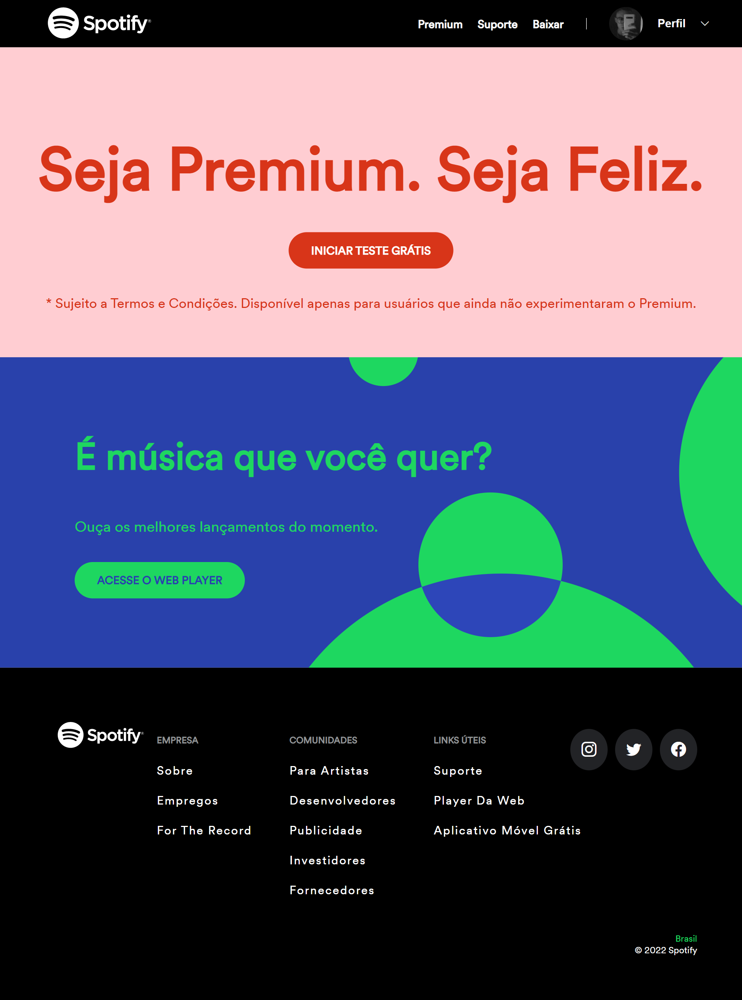

# Spotify Web Clone

Replicação da mais nova página do spotify, abordando conceitos em Javascript, HTML e CSS.

## Acesse
https://spotifyclone-gamma.vercel.app/  

**Languages and Tools:**  

<code></code>
<code></code>
<code></code>

##  Contact Me  
  
   

